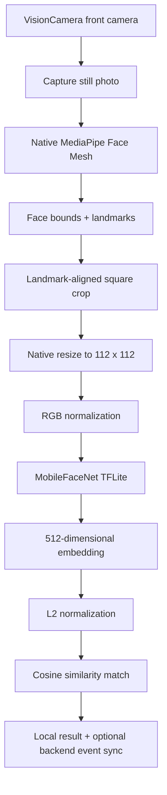

# Offline Face Authentication Hackathon Prototype

This repository contains a working hackathon prototype for secure offline face authentication and basic liveness detection on mobile devices. The main mobile implementation lives in `app/`, while the repository also contains existing backend/panel folders that are kept separate from the React Native app work.

The mobile app is focused on the hackathon problem statement:

- authenticate a field user without an active internet connection
- run face recognition on a standard Android/iOS device
- keep the AI model lightweight
- support liveness checks before accepting a face
- persist the enrolled face template locally
- optionally sync onboarding and auth events to backend APIs without blocking the user journey

The app currently uses a real on-device face pipeline. It does not mock embeddings or matching.

## Repository Layout

```text
face-detection/
  README.md
  app/                         React Native mobile app
  face-detection-backend/      Existing backend code
  panel/                       Existing panel/frontend code
```

Most of the face-auth implementation is inside:

```text
app/src/
  app/FaceAuthContext.tsx
  components/CameraPanel.tsx
  components/CaptureScreen.tsx
  faceAuth/backendApi.ts
  faceAuth/embeddingModel.ts
  faceAuth/localTemplateStore.ts
  faceAuth/matching.ts
  faceAuth/modelConfig.ts
  faceAuth/preprocessing.ts
  native/FaceTemplateStore.ts
  native/MediaPipeFaceMesh.ts
  navigation/
  screens/
```

Native face-processing code lives in:

```text
app/android/app/src/main/java/com/morthhackathon/
  MediaPipeFaceMeshModule.kt
  MediaPipeFaceMeshPackage.kt
  FaceTemplateStoreModule.kt

app/ios/MorthHackathon/
  MediaPipeFaceMesh.swift
  MediaPipeFaceMeshBridge.m
  FaceTemplateStore.swift
  FaceTemplateStoreBridge.m
```

Model assets are copied into JS, Android, and iOS locations:

```text
app/src/assets/models/
  face_landmarker.task
  w600k_mbf_float16.tflite

app/android/app/src/main/assets/models/
  face_landmarker.task
  w600k_mbf_float16.tflite

app/ios/MorthHackathon/Models/
  face_landmarker.task
  w600k_mbf_float16.tflite
```

## Tech Stack

- React Native `0.80.2`
- TypeScript
- Yarn classic
- React Navigation native stack
- `react-native-vision-camera` for camera preview and still capture
- MediaPipe Face Landmarker / Face Mesh through custom native modules
- `react-native-fast-tflite` for MobileFaceNet TFLite inference
- Native persistent storage for the enrolled face template:
  - Android: SharedPreferences
  - iOS: UserDefaults

The app package/bundle identifier is:

```text
com.morthhackathon
```

## User Flow

The app has two major user journeys: onboarding and login.

### Fresh Install

When the app starts, `FaceAuthContext` tries to hydrate a saved local face template from native storage.

- If no template exists, the app opens the intro/onboarding entry screen.
- If a template exists, the app opens the home screen.

This is controlled by `app/src/navigation/AppNavigator.tsx` and the shared auth state in `app/src/app/FaceAuthContext.tsx`.

### Onboarding Flow

Onboarding creates the local face template used for offline verification.

1. User opens the app for the first time.
2. Intro screen shows an onboarding CTA.
3. User enters the onboarding camera screen.
4. Camera opens full-screen using the front camera.
5. App asks the user to slightly turn their head.
6. MediaPipe Face Mesh validates a first head turn.
7. App asks the user to turn slightly to the opposite side.
8. MediaPipe validates the opposite head movement.
9. Once liveness passes, the app captures a face image automatically.
10. The captured photo is passed through MediaPipe again.
11. A face crop is created from landmarks.
12. The crop is resized to `112 x 112`.
13. Pixels are normalized to the MobileFaceNet input format.
14. MobileFaceNet generates a 512-dimensional embedding.
15. User enters a User ID.
16. The embedding and user metadata are saved locally.
17. Backend onboarding/client registration is attempted in the background.
18. Navigation resets to Home.

There is no manual capture CTA in the onboarding camera screen. The user only follows the prompts. The app decides when the liveness and face data are good enough to continue.

### Login / Verification Flow

Login verifies the current camera face against the locally stored template.

1. User opens Home.
2. User taps Login.
3. App opens a full-screen camera.
4. Camera waits briefly for a clear face.
5. App captures a photo automatically.
6. MediaPipe detects the face and landmarks.
7. Native preprocessing creates a normalized `112 x 112` RGB face crop.
8. MobileFaceNet generates a live 512-dimensional embedding.
9. The live embedding is compared against the locally stored embedding.
10. If cosine similarity is above threshold, the user is authenticated.
11. If it is below threshold, the app stays on the login camera and retries.
12. Auth event sync is attempted in the background if backend client registration exists.

The UI intentionally does not expose the exact score to the user. It only shows normal user-facing copy like "Face matched" or "Face did not match". Detailed scores are logged for debugging.

## High-Level Architecture



## Camera Layer

Camera capture is implemented in `app/src/components/CameraPanel.tsx`.

The app uses `react-native-vision-camera`:

- `useCameraDevice('front')` selects the front camera.
- `useCameraPermission()` checks/request camera permission.
- `<Camera photo />` renders the live preview and enables still capture.
- `camera.takePhoto()` captures the image used for MediaPipe and MobileFaceNet.

Important current behavior:

- The camera preview is full-screen.
- The guide box is a static visual frame.
- Face validation is performed after photo capture using MediaPipe Face Mesh.
- The current implementation does not run MediaPipe as a continuous frame processor on every preview frame.

That means "auto detection" in this prototype is capture-loop based:

- the screen schedules automatic photo samples
- each sample is checked by MediaPipe
- if no face is detected, it retries
- if the face/liveness condition passes, the flow advances

This keeps the implementation simpler and avoids relying on a live JS frame processor for the hackathon prototype.

## MediaPipe Face Mesh

MediaPipe is used for face detection, landmark extraction, and liveness pose checks.

The JS wrapper is:

```text
app/src/native/MediaPipeFaceMesh.ts
```

It exposes two native methods:

```ts
detectFaceMesh(imagePath)
createNormalizedFaceCrop(imagePath, cropRect, targetWidth, targetHeight)
```

### Android MediaPipe

Android implementation:

```text
app/android/app/src/main/java/com/morthhackathon/MediaPipeFaceMeshModule.kt
```

It uses the MediaPipe Tasks Vision FaceLandmarker asset:

```text
app/android/app/src/main/assets/models/face_landmarker.task
```

The Android module:

- decodes the captured photo
- handles image orientation
- attempts detection across expected rotations
- runs MediaPipe Face Landmarker
- returns image dimensions, face bounds, and landmark points to JS
- performs native crop/resize/normalization when requested

### iOS MediaPipe

iOS implementation:

```text
app/ios/MorthHackathon/MediaPipeFaceMesh.swift
```

It uses:

```text
app/ios/MorthHackathon/Models/face_landmarker.task
```

The iOS module:

- loads the captured photo
- normalizes the image orientation
- runs MediaPipe Face Landmarker in image mode
- returns bounds and landmarks to JS
- performs native crop/resize/normalization through CoreGraphics

### What MediaPipe Returns

The JS layer receives:

```ts
type MediaPipeFaceMeshResult = {
  bounds: {
    x: number;
    y: number;
    width: number;
    height: number;
  };
  detectionRotationDegrees?: number;
  imageHeight: number;
  imageWidth: number;
  landmarks: Array<{
    index: number;
    x: number;
    y: number;
    z: number;
    normalizedX: number;
    normalizedY: number;
  }>;
};
```

The app typically receives around 478 landmarks from MediaPipe.

## Liveness Detection

Liveness is implemented in:

```text
app/src/screens/OnboardFaceScreen.tsx
```

The current liveness challenge is an active head-turn check.

The app asks for:

1. a slight head turn to either side
2. a slight movement to the opposite side

The app does not ask the user to press capture. It samples photos automatically and checks head pose using landmarks.

### Landmarks Used

The liveness check uses:

- Nose tip: landmark `1`
- Left eye corner: landmark `33`
- Right eye corner: landmark `263`

### Head Turn Calculation

The calculation is:

```text
faceCenterX = (leftEye.x + rightEye.x) / 2
rawEyeDistance = abs(rightEye.x - leftEye.x)
denominator = max(rawEyeDistance, faceBounds.width * 0.28, 1)
yawOffset = nose.x - faceCenterX
yawOffsetRatio = yawOffset / denominator
```

A turn is considered meaningful when:

```text
abs(yawOffsetRatio) >= 0.07
```

For the opposite movement, the app checks whether:

- the yaw sign changed, or
- the yaw delta is large enough, or
- the normalized face center moved enough

Current thresholds:

```text
HEAD_TURN_THRESHOLD_RATIO = 0.07
OPPOSITE_POSE_DELTA_RATIO = 0.06
OPPOSITE_FACE_CENTER_DELTA_RATIO = 0.025
```

These thresholds are intentionally mild because the user should not need to turn too far. The goal is to prove live motion, not force an exaggerated pose.

## Face Cropping and Preprocessing

Cropping and preprocessing are implemented in:

```text
app/src/faceAuth/preprocessing.ts
```

The purpose is to convert a real camera photo into the exact tensor expected by MobileFaceNet:

```text
112 x 112 x 3 RGB Float32
```

### Step 1: Run MediaPipe on Captured Photo

Every onboarding and verification capture goes through:

```ts
detectMediaPipeFaceMesh(photoPath)
```

This ensures cropping is based on the actual captured image, not only on preview coordinates.

### Step 2: Build a Landmark-Aligned Crop

The preferred crop strategy is `landmark-eye-mouth`.

It uses:

- left eye outer: landmark `33`
- right eye outer: landmark `263`
- left mouth: landmark `61`
- right mouth: landmark `291`
- chin: landmark `152`
- forehead: landmark `10`

The app calculates:

```text
eyeCenter = midpoint(leftEyeOuter, rightEyeOuter)
mouthCenter = midpoint(leftMouth, rightMouth)
eyeDistance = distance(leftEyeOuter, rightEyeOuter)
eyeToMouthDistance = distance(eyeCenter, mouthCenter)
faceHeight = abs(chin.y - forehead.y)
```

Then it chooses a square crop size:

```text
side = max(
  eyeDistance / 0.38,
  eyeToMouthDistance / 0.34,
  faceHeight * 1.12
)
```

The crop is positioned around the eyes:

```text
startX = eyeCenter.x - side * 0.5
startY = eyeCenter.y - side * 0.38
```

Then it is clamped inside the image boundaries.

This is more stable than using only a face bounding box because the model expects a reasonably aligned face. Eye/mouth/chin positioning helps keep the crop consistent between onboarding and verification.

### Step 3: Fallback Crop

If required landmarks are unavailable, the app falls back to `mesh-bounds`.

That fallback:

- uses MediaPipe face bounds
- creates a square crop centered on the face
- expands the side by `1.55x`
- clamps the result inside the image

### Step 4: Native Crop and Resize

After JS decides the crop rectangle, native code performs:

- crop from original photo
- resize to `112 x 112`
- RGB extraction
- normalization

This happens natively for performance and pixel correctness.

Android uses Bitmap APIs. iOS uses CoreGraphics.

### Step 5: Pixel Normalization

MobileFaceNet expects RGB values normalized as:

```text
normalized = (pixel - 127.5) / 128
```

So each RGB pixel value is converted from `[0, 255]` into approximately `[-1, 1]`.

The final tensor length is:

```text
112 * 112 * 3 = 37632
```

## Nitro Image Status

The current implementation does not use `react-native-nitro-image`.

It was explored earlier for image manipulation, but it introduced native/new-architecture instability in this project. The final app currently avoids it and performs image preprocessing inside custom native modules:

- `MediaPipeFaceMeshModule.kt` on Android
- `MediaPipeFaceMesh.swift` on iOS

So when reading this codebase:

- VisionCamera is responsible for camera preview and photo capture.
- MediaPipe native modules are responsible for face detection, landmarks, crop, resize, and RGB normalization.
- MobileFaceNet through `react-native-fast-tflite` is responsible for embedding generation.

There is no Nitro Image dependency in the active face verification pipeline.

## MobileFaceNet Model

Face recognition is implemented with MobileFaceNet ArcFace in TFLite format.

The model config is in:

```text
app/src/faceAuth/modelConfig.ts
```

Current config:

```text
modelVersion: mobilefacenet_arcface_w600k_fp16_v1
modelAssetName: w600k_mbf_float16.tflite
inputWidth: 112
inputHeight: 112
inputChannels: 3
embeddingSize: 512
similarityThreshold: 0.69
normalizeMean: 127.5
normalizeStd: 128
```

The model file:

```text
w600k_mbf_float16.tflite
```

is bundled for:

- Metro/JS asset resolution
- Android assets
- iOS app bundle

## Embedding Generation

Embedding generation is implemented in:

```text
app/src/faceAuth/embeddingModel.ts
```

The pipeline is:

1. Validate crop is exactly `112 x 112`.
2. Validate tensor length is `37632`.
3. Load MobileFaceNet using `react-native-fast-tflite`.
4. Run inference with the normalized RGB tensor.
5. Read the model output.
6. Validate output size is `512`.
7. L2-normalize the vector.
8. Return the normalized embedding.

The TFLite model is loaded with:

```ts
loadTensorflowModel(modelAsset, 'default')
```

The model is cached in memory after the first load so repeated verification attempts do not reload the `.tflite` file every time.

### Why L2 Normalization Matters

The model output is normalized before storage and matching:

```text
normalizedVector = vector / magnitude(vector)
```

This makes cosine similarity meaningful and stable. Once both embeddings have magnitude `1`, their dot product directly represents cosine similarity.

## Face Matching

Matching is implemented in:

```text
app/src/faceAuth/matching.ts
```

The app performs one-to-one matching:

- live embedding from current camera capture
- stored embedding from local onboarding

It does not search through many users.

The comparison uses cosine similarity:

```text
similarity = dot(liveEmbedding, storedEmbedding) / (|liveEmbedding| * |storedEmbedding|)
```

Current threshold:

```text
0.69
```

Decision:

```text
similarity >= threshold -> authenticated
similarity < threshold  -> rejected
```

The score is logged for debugging, but it is not displayed to the end user.

## Local Template Storage

Local persistence is implemented in:

```text
app/src/faceAuth/localTemplateStore.ts
app/src/native/FaceTemplateStore.ts
```

Native implementations:

```text
Android: app/android/app/src/main/java/com/morthhackathon/FaceTemplateStoreModule.kt
iOS:     app/ios/MorthHackathon/FaceTemplateStore.swift
```

The stored template includes:

```ts
type FaceTemplate = {
  templateId: string;
  personnelId: string;
  displayName: string;
  embedding: number[];
  modelVersion: string;
  threshold: number;
  createdAt: string;
  backendClientId?: string;
  backendSyncedAt?: string;
  backendUserId?: string;
};
```

This is what allows the app to work offline after onboarding. Relaunching the app should hydrate this native template and go directly to Home instead of Intro.

The Home screen also has a Clear Data action, which removes the saved template.

## Offline API Queue and Backend Sync

Backend integration is offline-first. API calls are not sent directly and forgotten. They are first written to a local durable queue, then the queue processor tries to send them.

Queue and backend implementation:

```text
app/src/faceAuth/backendApi.ts
app/src/faceAuth/syncQueueStore.ts
app/src/faceAuth/syncQueueProcessor.ts
app/src/faceAuth/authEventQueue.ts
```

Production base URL:

```text
https://api.cars24.com/gw/plt/bffsvc
```

Tenant header:

```text
x-tenant-id: Cars24
```

The sync queue is persisted using the same native bridge family as the face template:

```text
Android: SharedPreferences
iOS:     UserDefaults
```

Native storage methods are exposed from:

```text
app/src/native/FaceTemplateStore.ts
```

and implemented in:

```text
app/android/app/src/main/java/com/morthhackathon/FaceTemplateStoreModule.kt
app/ios/MorthHackathon/FaceTemplateStore.swift
```

### Queue Behavior

The queue stores API jobs with:

- job id
- job type
- status: `pending`, `syncing`, or `synced`
- attempt count
- creation/update timestamps
- last attempt timestamp
- last error
- API payload needed to retry

Current job types:

```text
REGISTER_USER
REGISTER_CLIENT
AUTH_EVENT
```

This means the app does not lose an API call when:

- there is no internet
- the backend is down
- the request times out
- app is closed while a sync is running

On the next app launch, any job stuck in `syncing` is restored to `pending` and retried.

### Retry Triggers

The queue processor runs:

- after app hydration
- after onboarding queues a backend user call
- after login queues an auth event
- every 15 seconds while the app is open
- whenever the app returns to foreground
- when the user taps `Retry Sync Now` on the Sync Status screen

This gives us the practical behavior we need: if the internet is disconnected, jobs stay pending. Once internet is restored, the next processor tick sends the pending calls.

### Onboarding Sync

After local onboarding succeeds, the app queues:

1. `POST /api/users`
2. `POST /api/clients`

These are intentionally separate queue jobs.

If `POST /api/users` succeeds but `POST /api/clients` fails, the backend user ID is saved locally and only the client registration remains pending. This avoids losing progress between dependent API calls.

The backend response IDs are saved into the local face template when available:

- `backendUserId`
- `backendClientId`

If the backend request fails, onboarding still succeeds locally and the API job remains pending.

### Auth Event Sync

After a login match attempt, the app queues:

```text
POST /api/clients/<backendClientId>/sync/events
```

If the `backendClientId` is not available yet, the auth event stays pending with a waiting error. Once client registration succeeds and the local template has a backend client ID, the auth event can sync.

Failures are logged and kept in the queue. They do not block login.

### Sync Status Screen

The Home screen has a `Sync Status` action.

The Sync Status screen shows:

- pending API calls
- synced API calls
- job type
- status
- attempts
- created timestamp
- last attempt timestamp
- last error

It also has a `Retry Sync Now` button for manual retry.

`Clear all data` removes both the local face template and the local API sync queue.

## Logging and Debugging

The app logs detailed JSON-style messages for important face-auth steps:

- camera initialization
- photo capture
- MediaPipe face bounds and landmarks
- crop rectangle
- normalized tensor stats
- TFLite model load/run
- embedding vector stats
- match result
- backend request/sync status
- liveness turn details

Useful tags include:

```text
camera:v4:initialized
camera:v4:capture-start
camera:v4:capture-complete
face-auth:preprocess:crop-input
face-auth:preprocess:tensor
face-auth:tflite:load-model
face-auth:tflite:run
face-auth:tflite:output
face-auth:embedding:normalized
face-auth:match
face-auth:liveness:head-turn
backend:request
backend:onboarding-sync:complete
backend:auth-event:complete
```

These logs are intentionally copyable because model/crop tuning depends heavily on comparing captured crops, tensor stats, and similarity scores across devices.

## Permissions

The app requires camera permission.

On iOS, the app must include camera permission text in `Info.plist`.

On Android, the app must request camera permission and declare it in the manifest.

The app checks permission before entering camera-heavy flows where possible. If permission is denied, the user should remain outside the camera screen and be guided to enable permission.

## Why This Design Works Offline

After onboarding, the app has everything it needs locally:

- the MobileFaceNet model
- the MediaPipe Face Mesh model
- the enrolled 512-dimensional face embedding
- the similarity threshold
- native camera access
- native crop/resize/preprocessing

No network call is needed for verification.

The backend APIs are useful for:

- creating the server-side user
- registering the device/client
- syncing auth events

But those calls are not required to authenticate the user on-device.

## Setup

For the detailed real-device setup where the backend runs on the laptop and the app connects through the phone hotspot, see [Local App and Backend Setup Guide](SETUP_GUIDE.md).

From the mobile app folder:

```sh
cd app
yarn install
```

For iOS:

```sh
cd app/ios
bundle exec pod install
```

For Android:

```sh
cd app
yarn android
```

For iOS:

```sh
cd app
yarn ios
```

Because this app includes native modules and native model assets, reinstall the native app after changing:

- native Android/iOS files
- pods
- Gradle dependencies
- model asset locations
- native bridge method signatures

## Android APK Build

To build a release APK:

```sh
cd app/android
./gradlew assembleRelease
```

The generated APK is expected at:

```text
app/android/app/build/outputs/apk/release/app-release.apk
```

For this hackathon prototype, the release build can use the project debug signing config if a formally signed Play Store artifact is not required.

## Known Limitations and Next Improvements

Current limitations:

- MediaPipe validation is capture-loop based, not continuous live frame processing.
- The preview guide box is static, while the actual detection happens after still capture.
- The threshold `0.69` is tuned for one-to-one matching in the current prototype and should be validated on a larger local test set.
- Liveness currently uses head-turn only.
- Backend sync is fire-and-forget and does not yet include a persistent offline event queue.
- The app stores a single local template; multi-user local search is intentionally not implemented for this one-to-one attendance/login flow.

Recommended next improvements:

- add a real moving preview face bounding box with a performant frame processor
- store multiple enrollment embeddings per user, such as front/left/right, and average or compare against all
- save failed/success auth events in SQLite and purge only after confirmed backend sync
- add image-quality checks: blur, brightness, face size, occlusion
- tune threshold on real target-device data
- add blink or smile challenge as a second liveness signal
- encrypt the local face template using platform keystore/keychain backed encryption

## Mental Model for Evaluators

The most important thing to understand is that this app turns a camera photo into a biometric vector completely on-device.

```text
Camera photo
  -> MediaPipe face + landmarks
  -> landmark-aligned crop
  -> 112 x 112 RGB normalized tensor
  -> MobileFaceNet
  -> 512-dimensional embedding
  -> cosine similarity against stored embedding
  -> offline auth decision
```

The backend can receive onboarding/client/event data, but the core authentication decision is local and offline.
